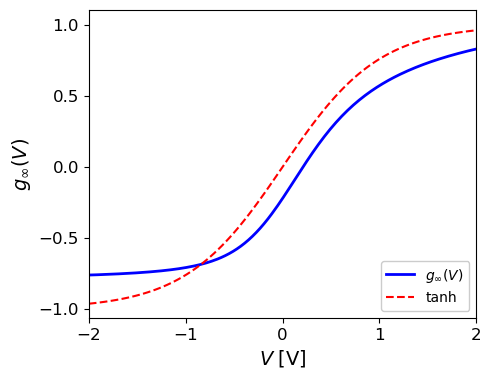
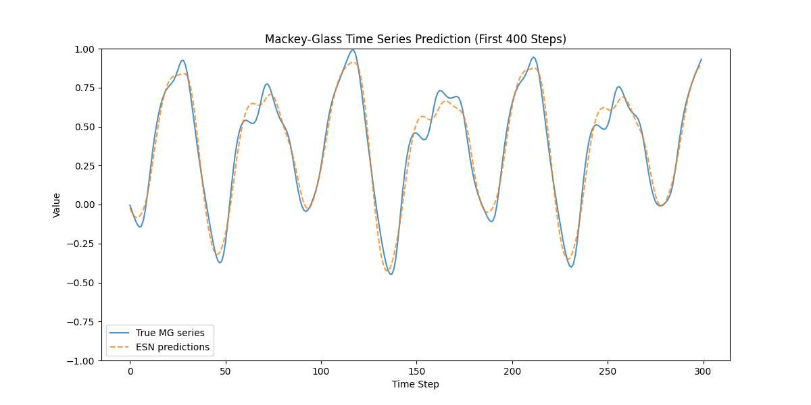
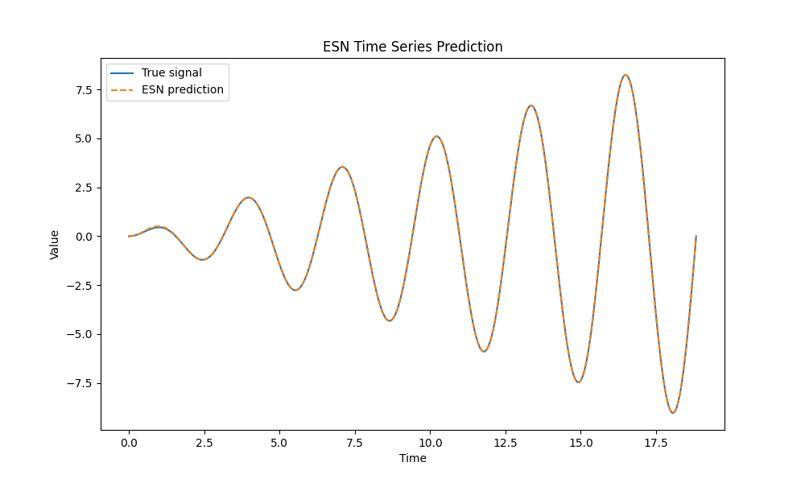

# Pyontronics, Physical Reservoir Computing with Iontronic Memristors

[](https://doi.org/10.5281/zenodo.15113279)

## Overview

**Pyontronics** is a Python framework for modelling physical reservoir computing using (iontronic) memristors.

The package provides two complementary approaches to building memristive reservoir computers:

| Module | Description | Circuit model |
|---|---|---|
| `echo_state_network` | Model a physical Echo State Networks (ESN) or Band-pass Network (BPN) with (iontronic) memristors as leaky-integrator nodes, where their steady-state conductance $g_{\infty}(V)$ acts as the activation function. | Memristors connected via active peripheral circuitry |
| `memristor_network` | Physical Kirchhoff circuit simulation with memristors as edges. Either the free-node voltages (or memristor conductances) serve as features for the readout function. | Fully fluidic graph-based circuit solved via Kirchhoff's current law |

Both modules leverage the same underlying memristor physics, but differ in how the memristors are connected in a network circuit.

---

## Installation

1. Clone or download this repository.
2. Install required libraries:
```console
pip install -r requirements.txt
```
3. Open and run the demo notebooks included in the repository.

---

## Module 1 — Echo State Network (`echo_state_network`)

The echo_state_network module of [Version v.0.2.0](https://doi.org/10.5281/zenodo.17076466) was used for the results in [T.M. Kamsma, J.J. Teijema, R. van Roij, and C. Spitoni, *Chaos* 35, 093133 (2025)](https://doi.org/10.1063/5.0273574).

### Description

This repository provides an Echo State Network (ESN) and Band-pass Network (BPN) framework based on a physical circuit. The code is designed for both continuous data streams and sets of shorter pulses, each with a single label. The networks contain (iontronic) memristors, whose dynamic conductance exhibit the behaviour of leaky-integrator neurons. The physical (sigmoidal) steady-state conductance $g_{\text{inf}}(V)$ of the memristor nodes takes on the role of the activation function, while its conductance memory exhibits the same dynamics as leaky integrator nodes.

The module handles both:

1. **Single time series** — predicting at each time step (`EchoStateNetwork`).
2. **Multiple shorter pulses** — predicting a single label at the end of each pulse (`PulseEchoStateNetwork`).

A **Band-pass** variant (`BandPassNetwork` / `PulseBandPassNetwork`) assigns each reservoir node its own timescale, enabling frequency-selective processing.

### Classes

| Class | Base | Use case |
|---|---|---|
| `EchoStateNetwork` | — | Per-timestep prediction on a single time series |
| `PulseEchoStateNetwork` | `EchoStateNetwork` | Single-label prediction per input pulse |
| `BandPassNetwork` | `EchoStateNetwork` | Per-timestep prediction with per-node timescales |
| `PulseBandPassNetwork` | `BandPassNetwork` + `PulseEchoStateNetwork` | Single-label prediction with per-node timescales |

### EchoStateNetwork Parameters

| Parameter | Type | Default | Description |
|---|---|---|---|
| `input_dim` | int | — | Dimension of input features |
| `reservoir_size` | int | — | Number of neurons in reservoir |
| `output_dim` | int | — | Dimension of output targets |
| `leaking_rate` | float | 1.0 | Self-coupling constant ($a \in (0,1]$) |
| `step_size` | float | 0.3 | Discrete time step ($\delta$) |
| `time_scale` | float | 1.0 | Base timescale ($c$) |
| `spectral_radius` | float | 0.9 | Spectral radius of $W_{\text{res}}$ |
| `sparsity` | float | 0.5 | Fraction of zero weights in $W_{\text{res}}$ |
| `input_scaling` | float | 1.0 | Scaling factor applied to input |
| `regularization` | float | 1e-4 | Ridge regression regularization |
| `washout` | int | 100 | Initial timesteps to discard during training |
| `washout_inference` | int | 0 | Initial timesteps to discard during prediction |
| `weight_seed` | int | 42 | Random seed for weight initialization |
| `activation` | callable | `np.tanh` | Nonlinear activation function |
| `guarantee_ESP` | bool | True | Enforce Echo State Property |
| `progress_bar` | bool | True | Show training progress bars |
| `apply_dynamics_per_step_size` | int | 1 | Number of substeps per $\delta$ |
| `choose_W_in` | bool | False | Use custom input weights |
| `W_in_input` | np.ndarray | None | Custom $W_{\text{in}}$ matrix (shape `[reservoir_size, input_dim]`) |

### BandPassNetwork Additional Parameters

| Parameter | Type | Default | Description |
|---|---|---|---|
| `time_scale_std` | float | 1.0 | Standard deviation of per-neuron timescale distribution |
| `choose_timescales` | bool | False | Use custom timescale array |
| `timescale_array_input` | np.ndarray | None | Custom timescales (shape `[reservoir_size,]`) |

### Physical Interpretation

Key physical relationships:
- **Physical timescale**: $\tau = c / a$ = `time_scale` / `leaking_rate`
- **Physical conductance as activation**: `activation` can be set to a physical dynamic conductance (e.g. `GinfActivator.activate`)

### Figures





---
### Optimization

The parameters of the ESN can be optimized for a dataset using Optuna. Example
files for optimization are included in the repository in the `optimization`
folder. Use `optuna-dashboard sqlite:///optuna_esn.db` to visualize the results.

This code requires the optuna library. Install it using
```console
pip install optuna
```
The dashboard requires the optuna-dashboard library. Install it using 
```console
pip install optuna optuna-dashboard
```

---

## Module 2 — Memristor Network (`memristor_network`)

The memristor_network module of [Version v.0.3.1](https://doi.org/10.5281/zenodo.19314455) was used for the results in [T.M. Kamsma, Y. Gu, D. Shi, C. Spitoni, M. Dijkstra, Y. Xie, and R. van Roij, *Faraday Discussions* (2026)](https://doi.org/10.1039/D5FD00168D).

### Description

This module simulates a physical circuit whose edges are memristors that obeys Kirchhoff's current law. The circuit topology is specified as a graph with an incidence matrix. Voltages can be imposed on selected vertices (inputs) while one or more vertices are grounded. The resulting free-node voltages (or memristor conductances) serve as the reservoir state from which a linear readout is trained via ridge regression.

### Class

| Class | Description |
|---|---|
| `MemristorNetwork` | Kirchhoff-circuit reservoir with memristive edges |

### MemristorNetwork Parameters

**Constructor**

| Parameter | Type | Default | Description |
|---|---|---|---|
| `num_vertices` | int | — | Number of vertices (nodes) in the circuit |
| `num_edges` | int | — | Number of memristors (edges) in the circuit |
| `ground_vertices` | list | `[0]` | Indices of grounded vertices |
| `dt` | float | 0.01 | Simulation time step |
| `activation` | callable | `np.tanh` | Steady-state conductance function $\sigma$ |

**Memristor parameters** (set via `set_memristor_parameters`)

| Parameter | Type | Default | Description |
|---|---|---|---|
| `g0_values` | array | ones | Maximum conductance $g_0$ per memristor |
| `tau_values` | array | ones | Memory timescale $\tau$ per memristor |

**Prediction parameters** (set via `set_prediction_parameters`)

| Parameter | Type | Default | Description |
|---|---|---|---|
| `use_conductances` | bool | True | Use conductances as features (`True`) or free-node voltages (`False`) |
| `prediction_window` | int | 10 | Steps ahead to predict (multiple of `dt`) |
| `regularization` | float | 1e-4 | Ridge regression regularization coefficient |

---

## Activators

Both modules can use physically derived activation functions provided in `steady_state_conductance.py`:

| Class | Device | Reference |
|---|---|---|
| `GinfActivator` | Conical microfluidic memristor | [Kamsma et al., *Phys. Rev. Lett.* **130**, 268401 (2023)](https://doi.org/10.1103/PhysRevLett.130.268401) |
| `NCNM_activator` | Iontronic Nanochannel Membrane Memristor | [Kamsma & Kim et al., *PNAS* **121**, e2320242121 (2024)](https://doi.org/10.1073/pnas.2320242121) |
| `ExperimentalActivation` | Any device (lookup table) | User-supplied experimental data |


---


## Authors

Tim Maarten Kamsma

Jelle Jasper Teijema

## License

This project is released under the MIT License.

## Contact & Citation

The echo_state_network module of [Version v.0.2.0](https://doi.org/10.5281/zenodo.17076466) was used for the results in [T.M. Kamsma, J.J. Teijema, R. van Roij, and C. Spitoni, *Chaos* 35, 093133 (2025)](https://doi.org/10.1063/5.0273574).

The memristor_network module of [Version v.0.3.1](https://doi.org/10.5281/zenodo.19314455) was used for the results in [T.M. Kamsma, Y. Gu, D. Shi, C. Spitoni, M. Dijkstra, Y. Xie, and R. van Roij, *Faraday Discussions* (2026)](https://doi.org/10.1039/D5FD00168D).

For questions, please contact t.m.kamsma@uu.nl
