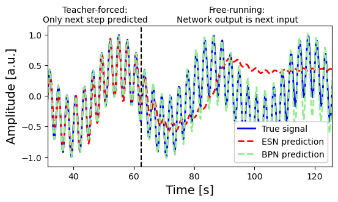

# Physical Reservoir Computing with (iontronic) Leaky-Integrator Neurons

[](https://doi.org/10.5281/zenodo.15113279)

## Abstract

This repository provides an Echo State Network (ESN) and Band-pass Network (BPN) framework based on a physical circuit. The code is designed for both continuous data streams and sets of shorter pulses, each with a single label. The networks contain (iontronic) memristors, whose dynamic conductance exhibit the behaviour of leaky-integrator neurons. The physical (sigmoidal) steady-state conductance $g_{\text{inf}}(V)$ of the memristor nodes takes on the role of the activation function, while its conductance memory exhibits the same dynamics as leaky integrator nodes.

## Unique Contribution

Our approach handles both:

1. Single time series (predicting at each step).
2. Multiple shorter series (pulses) (predicting a single label at the end of each pulse).

The leaky-integrator neurons and the integrated operator $g_{\text{inf}}$ allow for flexible state evolution that aligns with many practical tasks.

# usage

1. Clone or download this repository.
2. Install required libraries:
```console
pip install -r .\requirements.txt
```
3. Open and run the demo notebook included in the repository.

### EchoStateNetwork Core Parameters

| Parameter               | Type       | Default | Description |
|-------------------------|------------|---------|-------------|
| `input_dim`             | int        | -       | Dimension of input features |
| `reservoir_size`        | int        | -       | Number of neurons in reservoir |
| `output_dim`            | int        | -       | Dimension of output targets |
| `leaking_rate`          | float      | 1.0     | Self-coupling constant (a ∈ (0,1]) |
| `step_size`             | float      | 0.3     | Discrete time step (δ) |
| `time_scale`            | float      | 1.0     | Base timescale (c) |
| `spectral_radius`       | float      | 0.9     | Spectral radius of W_res |
| `sparsity`              | float      | 0.5     | Fraction of zero weights in W_res |
| `input_scaling`         | float      | 1.0     | Scaling factor applied to input |
| `regularization`        | float      | 1e-4    | Ridge regression regularization |
| `washout`               | int        | 100     | Initial timesteps to discard during training |
| `washout_inference`     | int        | 0       | Initial timesteps to discard during prediction |
| `weight_seed`           | int        | 42      | Random seed for weight initialization |
| `activation`            | callable   | np.tanh | Nonlinear activation function |
| `guarantee_ESP`         | bool       | True    | Enforce Echo State Property |
| `progress_bar`          | bool       | True    | Show training progress bars |
| `apply_dynamics_per_step_size` | int | 1 | Number of substeps per Δt |
| `choose_W_in`           | bool       | False   | Use custom input weights |
| `W_in_input`            | np.ndarray | None    | If `choose_W_in = True`: Custom W_in matrix (shape [reservoir_size, input_dim]) |

### BandPassNetwork Additional Parameters

| Parameter               | Type       | Default | Description |
|-------------------------|------------|---------|-------------|
| `time_scale_std`        | float      | 1.0     | Standard deviation of per-neuron timescale distribution |
| `choose_timescales`     | bool       | False   | Use custom timescale array |
| `timescale_array_input` | np.ndarray | None    | If `choose_timescales = True`: Custom timescales (shape [reservoir_size,]) |

### Physical Interpretation

Key physical relationships:
- **Physical timescale**: τ = `time_scale`/`leaking_rate` = c/a
- **Physical conductance as activation**: `activation` can be set to physical dynamic conductance

# Figures




# Optimization

The parameters of the ESN can be optimized for a dataset using optuna. Example
files for optimization are included in the repository in the optimization
folder. Use `optuna-dashboard sqlite:///optuna_esn.db` to visualize the results.

This code requires the optuna library. Install it using `pip install optuna`.
The dashboard requires the optuna-dashboard library. Install it using 
`pip install optuna-dashboard`.

## Authors

Tim Maarten Kamsma

Jelle Jasper Teijema


# License

This extension is released under the MIT License.

# Contact

This work is part of [https://doi.org/10.1063/5.0273574](https://doi.org/10.1063/5.0273574). For questions, please contact t.m.kamsma@uu.nl
