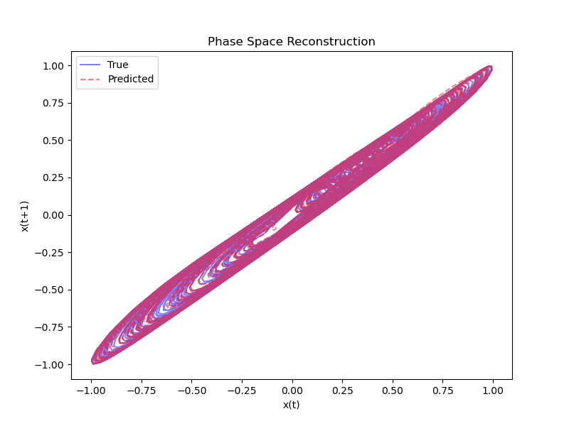

# Optimization and Applications of Echo State Networks with Leaky-Integrator Neurons
[](https://doi.org/10.5281/zenodo.15113279)

## Abstract
This repository provides an Echo State Network (ESN) and Band-pass Network (BPN) framework based on a physical circuit. The code is designed for both continuous data streams and sets of shorter pulses, each with a single label. The networks contain (iontronic) memristors, whose dynamic conductance exhibit the behaviour of leaky-integrator neurons. The physical (sigmoidal) steady-state conductance $g_{\text{inf}}(V)$ of the memristor nodes takes on the role of the activation function, while its conductance memory exhibits the same dynamics as leaky integrator nodes.

## Unique Contribution
Our approach handles both:

1. Single time series (predicting at each step).
2. Multiple shorter series (pulses) (predicting a single label at the end of each pulse).

The leaky-integrator neurons and the integrated operator $g_{\text{inf}}$ allow for flexible state evolution that aligns with many practical tasks.

# usage

1. Clone or download this repository.
2. Install required libraries:
```console
pip install -r .\requirements.txt
```
3. Open and run the demo notebook included in the repository.

## EchoStateNetwork Parameters
Below are the main parameters you can set when creating an EchoStateNetwork instance:

- input_dim: Dimension of the input data.
- reservoir_size: Number of neurons in the reservoir.
- output_dim: Dimension of the output data (e.g., number of classes or regression targets).
- leaking_rate (a): Self-coupling constant, controlling the decay of the reservoir state.
- step_size (d): Discrete time step used in updates.
- time_scale (c): Scaling factor for the reservoir’s internal time evolution.
- spectral_radius: Desired spectral radius of the reservoir weight matrix.
- sparsity: Fraction of reservoir weights set to zero to encourage sparse connectivity.
- input_scaling: Scaling factor applied to input weights.
- regularization: Regularization coefficient (λ) used in ridge regression for output weights.
- activation: Nonlinear activation function (default is $tahn$).

# Figures





# Optimization

The parameters of the ESN can be optimized for a dataset using optuna. Example
files for optimization are included in the repository in the optimization
folder. Use `optuna-dashboard sqlite:///optuna_esn.db` to visualize the results.

This code requires the optuna library. Install it using `pip install optuna`.
The dashboard requires the optuna-dashboard library. Install it using 
`pip install optuna-dashboard`.

## Authors
Tim Kamsma

Jelle Jasper Teijema


# License
This extension is released under the MIT License.

# Contact

This work is part of [publication]. For questions, please contact t.m.kamsma@uu.nl
