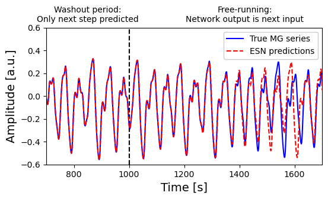

# Optimization and applications of echo state networks with leaky-integrator neurons
 
badges met DOIs

auteurs

practisch de abstract maar dan zonder plagiaat van jezelf

## uitleg unique contribution

uitleg

# usage

installeer `pip install -r .\requirements.txt`

open de demo file notebook

filetree

## EchoStateNetwork Params

hier komt een uitleg van de parameters van de class

- input_dim (int): Dimension of input data
- reservoir_size (int): Number of neurons in the reservoir
- output_dim (int): Dimension of output data
- leaking_rate (float): (a) Self coupling constant
- step_size (float): (d) Time step size
- time_scale (float): (c) Scale of time evolution
- spectral_radius (float): Spectral radius of reservoir weight matrix
- sparsity (float): Proportion of recurrent weights set to zero
- input_scaling (float): Scaling factor for input weights
- regularization (float): Regularization coefficient for ridge regression
- activation (func): Activation function for ESN nodes

$latex formule inclusief A D C$

# Figures

# License
This extension is published under the MIT license.

# Contact

This work is part of [publication]. For contact information email timkamsma